# Konfinity components

## 1 primaryNavigation

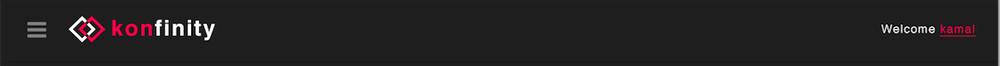

id: primaryNavigation

## 2 sidebarAlreadyCompleted

id: sidebarAlreadyCompleted

## 3 topicQueryForm
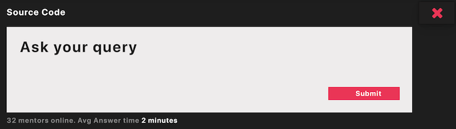

id: topicQueryForm

## 4 problemDashboard
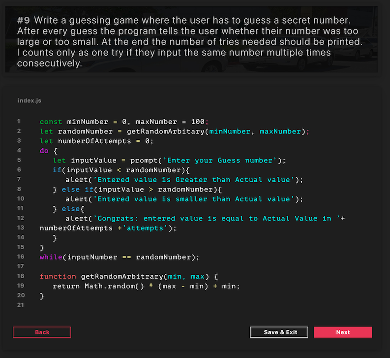

id: problemDashboard

## 5 courseDescription

id: courseDescription

## 6 coursePreviousQueries

id: coursePreviousQueries

## 7 problemIde
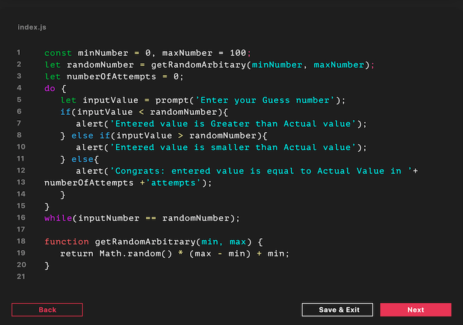

id: problemIde
## 8 userDashboard
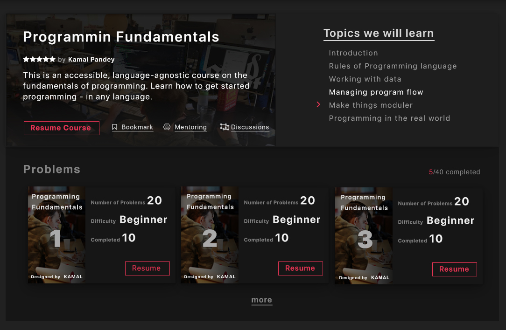

id: userDashboard

## 9 courseObjectives
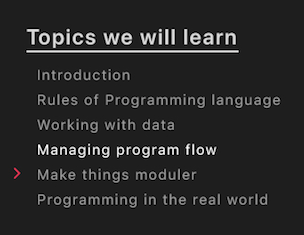

id: courseObjectives

## 10 problemDisplayBoard
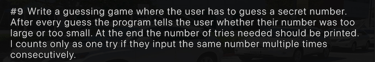

id: problemDisplayBoard

## 11 userInfoCard
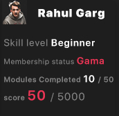

id: userInfoCard

## 12 courseProblemsOverview
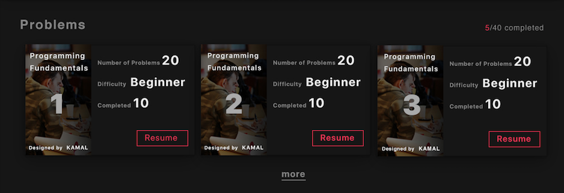

id: courseProblemsOverview

## 13 moduleActiveCard
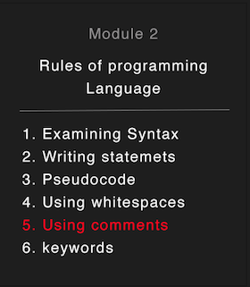

id: moduleActiveCard

## 14 courseModulesOverview
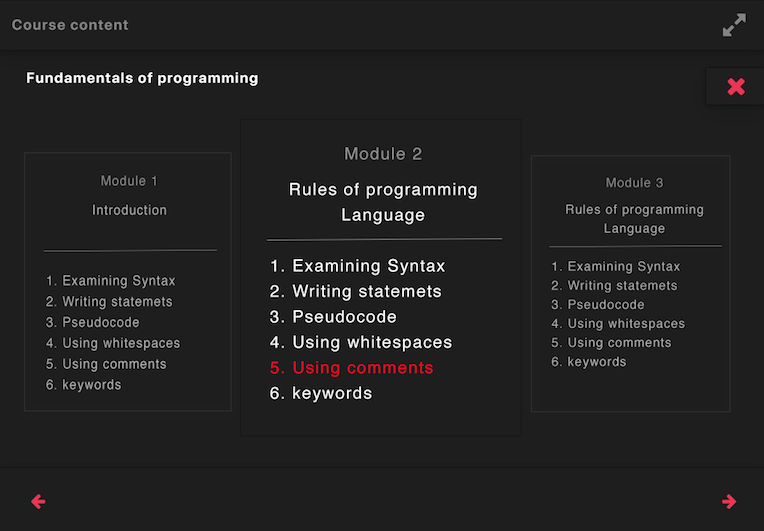

id: courseModulesOverview

## 15 menuButton

id: menuButton

## 16 sidebar
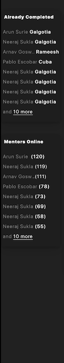

id: sidebar

## 17 topicInfoBoard
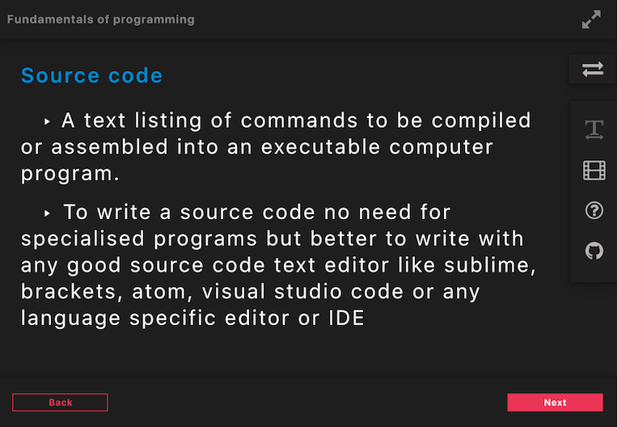

id: topicInfoBoard

## 18 sidebarMentors
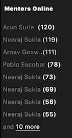

id: sidebarMentors

## 19 moduleInactiveCard
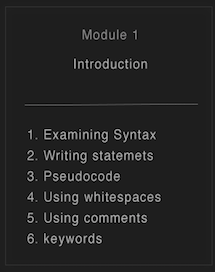

id:moduleInactiveCard

## 20 topicQueryPage

id: topicQueryPage
