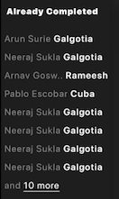
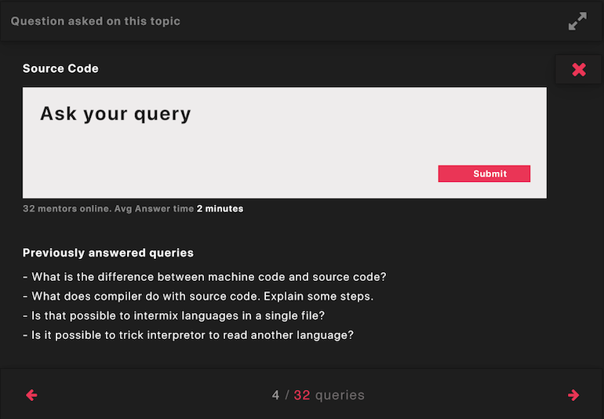
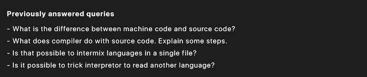

# Konfinity components

## 1 primaryNavigation

id: primaryNavigation

## 2 menuButton

id: menuButton

## 3 sidebar

id: sidebar

## 4 sidebarAlreadyCompleted

id: sidebarAlreadyCompleted

## 5 sidebarMentors

id: sidebarMentors

## 6 userInfoCard

id: userInfoCard

## 7 userDashboard

id: userDashboard

## 8 courseDescription

id: courseDescription

## 9 courseObjectives

id: courseObjectives

## 10 courseProblemsOverview

id: courseProblemsOverview

## 11 topicQueryPage

id: topicQueryPage

## 12 topicQueryForm

id: topicQueryForm

## 13 topicPreviousQueries

id: topicPreviousQueries

## 14 topicInfoBoard

id: topicInfoBoard

## 15 problemDashboard

id: problemDashboard

## 16 problemDisplayBoard

id: problemDisplayBoard

## 17 problemIde

id: problemIde

## 18 courseModulesOverview

id: courseModulesOverview

## 19 moduleActiveCard

id: moduleActiveCard

## 20 moduleInactiveCard

id:moduleInactiveCard

